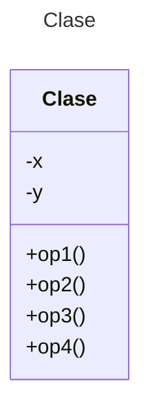

# Proyecto - Diagramas de Clases

Plantilla para ejercicios de diagramas de clases utilizando **Mermaid**

## Instrucciones
La platilla consta de dos ejercicios (Planteamiento/Diagrama de clases). Leer cada sección **Planteamiento de ejercicio** y diseñar el diagrama de clases en la sección **Diagrama de clases** inmediata siguiente.

## Planteamiento de ejercicio 1
Red de Computadora  
Especificar un diagrama de clases que describa redes de computadoras. Los elementos que se pueden incluir en la red son:
      Servidor, PC, Impresora.
      Hub, Cable de red.
Los PCs pueden conectarse con un único Hub, los servidores con uno o varios.
Los Servidores y PCs pueden generar mensajes, con una cierta longitud.
Los Hubs tienen un número de puertos, algunos de los cuales puede usarse para conectar con otros Hubs. Tienen cierta probabilidad de “perder” mensajes.
Las impresoras pueden averiarse, con cierta probabilidad, durante cierto tiempo.

## Diagrama de clases 1
[Editor en línea](https://mermaid.live/)

[Referencia-Mermaid](https://mermaid.js.org/syntax/classDiagram.html)

## Planteamiento de ejercicio 2
Universidad  
Se propone realizar un modelo simplificado de los distintos miembros de la comunidad universitaria. Todos los miembros de la comunidad universitaria se caracterizan por un nombre y un Documento Nacional de Identidad (dni). Los miembros se dividen en estudiantes o personal de la universidad. Todos los estudiantes tienen un número de identificación asociado: el nie.
En cuanto al personal, todos tienen un salario asignado y a su vez estos pueden ser personal docente investigador (pdi) o personal de administración y servicios (pas). Los pdi tienen asignada una asignatura que impartir (se identificará por el título) y los pas un edificio donde trabajan (se identificará por el nombre del edificio). Además de los anteriores, existen los doctorandos que son a la vez pdi y estudiantes. Los doctorandos se caracterizan por el título de la tesis doctoral sobre la que investigan.

## Diagrama de clases 2
[Editor en línea](https://mermaid.live/)

[Referencia-Mermaid](https://mermaid.js.org/syntax/classDiagram.html)


## Comandos Git-Cambios y envío a Autograding

### Por cada cambio importante que haga, actualice su historia usando los comandos:
```
git add .
git commit -m "Descripción del cambio"
```
### Envíe sus actualizaciones a GitHub para Autograding con el comando:
```
git push origin main
```
## Fin de Archivo
